# 🎬 Movie Browser

**Movie Browser** is a web application that allows users to search for movies and people by name using The Movie Database (TMDb) API. Users can browse popular movies and people, view detailed information, and navigate between movie and person profiles seamlessly.

## 📌 Table of Contents

1. 🌐 [Live Demo](#-live-demo)

2. 🎥 [Features](#-features)

3. 🖥️ [Technologies](#️-technologies-used)

4. 🚀 [Usage](#-usage)

5. 📸 [Screenshots](#-screenshots)

6. 🤝 [Contributors](#-contributors)

7. 🧑‍💻 [Project Management & Development Workflow](#-project-management--development-workflow)

8. ⚙️ [Installation](#️-installation)

9. 🛠️ [Getting Started with Create React App](#️-getting-started-with-create-react-app)


## 🌐 Live Demo

🚀 Check out the live version of the app:<br>
👉 [Movie Browser Live Demo](https://namerafal.github.io/movies-browser/)


## 🎥 Features

- **Movies List**: Displays a list of popular movies with:

   - Poster image

   - Movie title

   - Release year

   - Genres

   - Rating

   - Vote count

- **People List**: Shows popular actors, directors, and other film industry professionals with their photos and names.

- **Movie Details**: View detailed information about movies, including:

   - Movie banner

   - Production countries

   - Full release date

   - Movie description

   - Cast and Crew with their specific roles and jobs

- **Person Profile**: Clicking on person tile opens a profile page with:

   - picture
   
   - name

   - Date and place of birth

   - Description

   - Movie credits

- **Search Functionality**:

   - A search bar is available in the menu for searching movies and people.

   - As you start typing a search query, the results update dynamically without needing to submit a form.

- **Seamless Navigation**: From both the movie details page and person profile, you can:

   - Navigate from movie cast or crew to the person profile.

   - Navigate from person profiles (movie cast/crew) to detailed movie information.

- **Loader**: A loading spinner is displayed while data is being fetched from the TMDb API.

- **No Results View**: A message is shown when no search results are found.

- **Error Handling**: Proper error handling for API failures or missing data.

- **Responsive Design**: The app is optimized for both **desktop and mobile devices**.


## 🖥️ Technologies Used

- **Frontend**: JavaScript (ES6+), React

- **Styling**: Styled Components, Normalize CSS, GlobalStyle, theme

- **Layout Structure**:

   - Grid-based and flexbox-based layout for responsive design.

- **Routing**: React Router v5.3.3

- **State Management**: Redux, Redux Toolkit, Redux Saga

- **React Hooks**:

   - `useState`

   - `useRef`

   - `useEffect`

- **React Router Hooks**:

   - `useParams`

   - `useLocation`

   - `useHistory`

- **Custom Hooks**:

   - [`useUpdateQueryParameter`](src/common/Navigation/Search/queryParameters.js#12): Updates the search query parameter in the URL and handles navigation based on the updated query.

   - [`useQueryParameter`](src/common/Navigation/Search/queryParameters.js#6): A utility hook that retrieves query parameters from the URL.

   - [`useIsMobile`](src/useIsMobile.js): A hook that determines whether the application is being viewed on a mobile device by checking the screen size and listening for window resizing events.

   🔗 _Click on each hook name to view its implementation in the repository._

- **CSS Naming Conventions**: The project follows the **BEM methodology** for naming files.

- **Design**: The UI was built based on a design provided in **Figma**.


## 🚀 Usage

1. Open the app in your browser.

2. The app will automatically redirect to the **Movies** list page (`/movies`).

3. Use the navigation menu to access:

   - **Movies** (`/movies`) – A list of popular movies.

   - **People** (`/people`) – A list of popular actors, directors, and industry professionals.

4. Or use the **Search Bar** in the navigation menu to quickly find movies or people.

   - Start typing and results will dynamically update without requiring submission.

   - Search for movies on Movies page, or people on People page.

5. Click on a movie to view detailed information.

   - From the cast and crew, you can click on a person to view their profile.

6. Click on a person to view their profile.

   - From movie credits, you can click on a movie to view its detailed information.


## 📸 Screenshots

Here are some **gif demos** and **screenshots** showcasing the app:

**Movies List Page**

<div>
   
   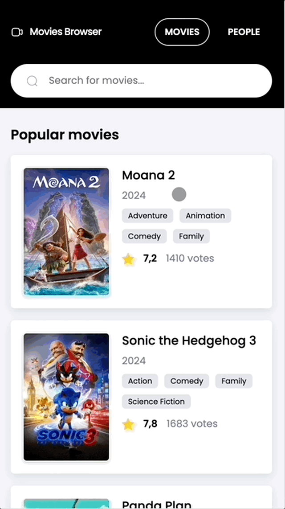
</div>

**Movie Details Page**

<div>
   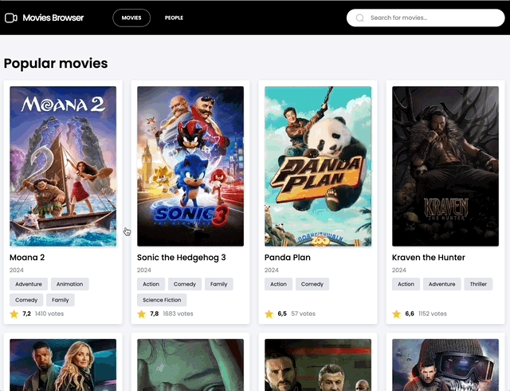
   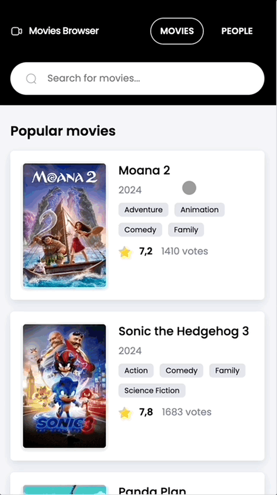
</div>

**People List Page**

<div>
   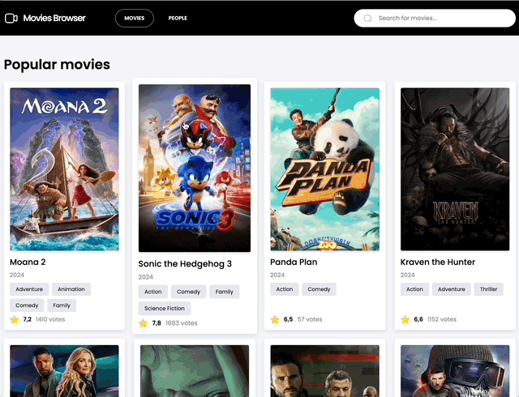
   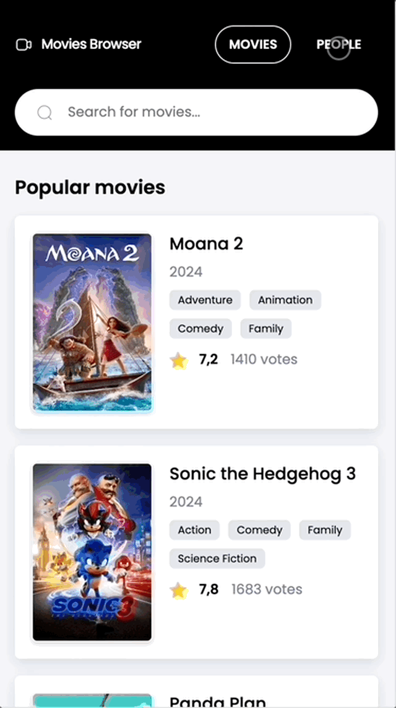
</div>

**Person Profile Page**

<div>
   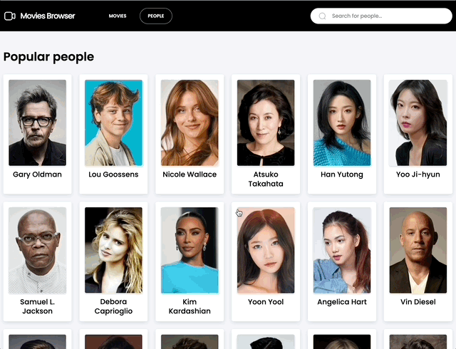
   
</div>

**Search Functionality**

<div>
   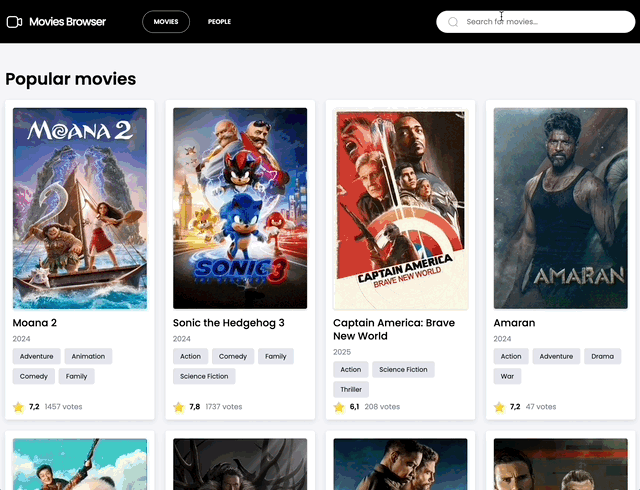
   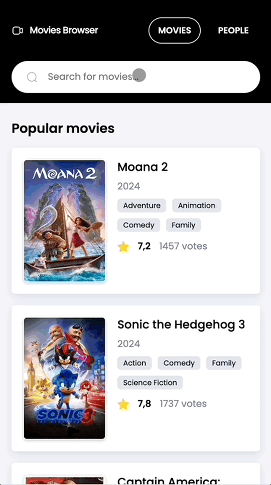
</div>

**Seamless Navigation**

<div>
   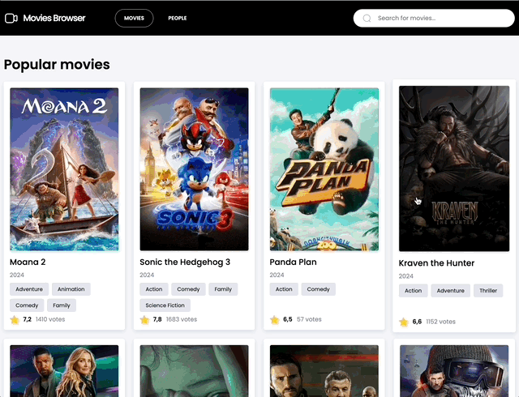
   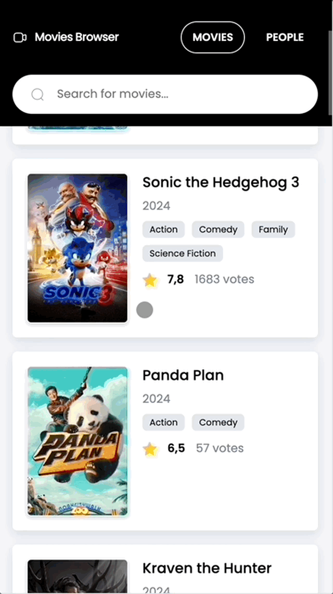
</div>

**No Results View**

<div>
   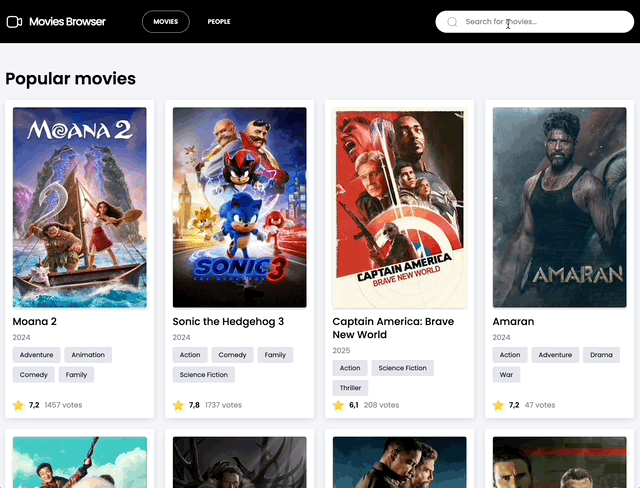
   
</div>

**Error**

<div>
   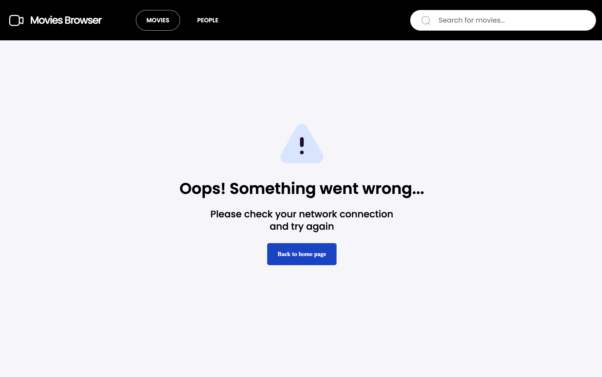
   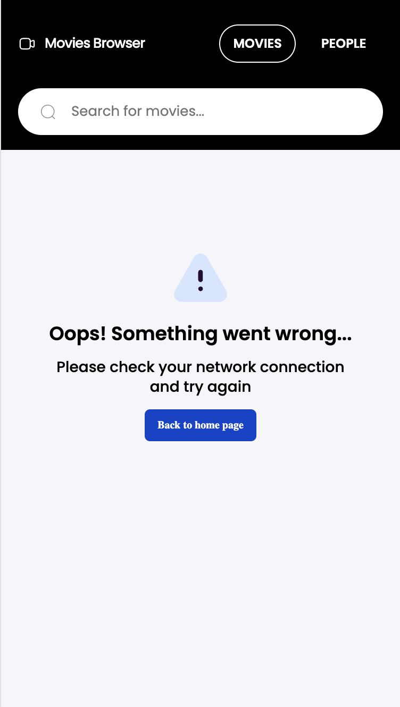
</div>


## 🤝 Contributors

This project was developed by:

- Angelina Kutuzova - [GitHub](https://github.com/akutuzova11)

- Donata Deptuła - [GitHub](https://github.com/dondeptu)

- Rafał Olewicz - [GitHub](https://github.com/namerafal)


## 🧑‍💻 Project Management & Development Workflow

- **Scrum Methodology**: The project was developed using Scrum practices.

- **Trello**: Used for task management and progress tracking.

- **Version Control**:

   - Pull Requests for merging code

   - Feature development on separate branches

   - Code reviews to maintain quality


## ⚙️ Installation

1. Clone the repository:

```
git clone https://github.com/namerafal/movies-browser.git
```

2. Navigate to the project directory:

```
cd movies-browser
```

3. Install the dependencies:

```
npm install
```

4. Add your TMDb API key to the `.env` file (create this file if it doesn't exist):

```
REACT_APP_TMDB_API_KEY=your_api_key_here
```

5. Run the development server:

```
npm start
```

The app should now be running at `http://localhost:3000`.


# 🛠️ Getting Started with Create React App

This project was bootstrapped with [Create React App](https://github.com/facebook/create-react-app).

## Available Scripts

In the project directory, you can run:

### `npm start`

Runs the app in the development mode.\
Open [http://localhost:3000](http://localhost:3000) to view it in your browser.

The page will reload when you make changes.\
You may also see any lint errors in the console.

### `npm run build`

Builds the app for production to the `build` folder.\
It correctly bundles React in production mode and optimizes the build for the best performance.

The build is minified and the filenames include the hashes.\
Your app is ready to be deployed!

See the section about [deployment](https://facebook.github.io/create-react-app/docs/deployment) for more information.

### `npm run eject`

**Note: this is a one-way operation. Once you `eject`, you can't go back!**

If you aren't satisfied with the build tool and configuration choices, you can `eject` at any time. This command will remove the single build dependency from your project.

Instead, it will copy all the configuration files and the transitive dependencies (webpack, Babel, ESLint, etc) right into your project so you have full control over them. All of the commands except `eject` will still work, but they will point to the copied scripts so you can tweak them. At this point you're on your own.

You don't have to ever use `eject`. The curated feature set is suitable for small and middle deployments, and you shouldn't feel obligated to use this feature. However we understand that this tool wouldn't be useful if you couldn't customize it when you are ready for it.
